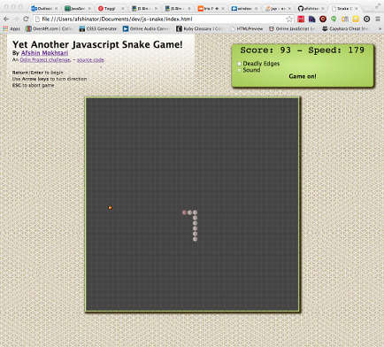

## Yet another Snake game implementation - 

#### An Odin Project challenge to flex some JS, JQuery, ...

- Idea from <a href="http://www.theodinproject.com/javascript-and-jquery/jquery-and-the-dom" target="_blank">this Odin Project challenge</a>.

- Live preview [here](http://htmlpreview.github.io/?https://github.com/afshinator/js-snake/blob/master/index.html)

**Details:**

"Basically, it's a snake that you have to move around the board and which grows longer with each piece of food it eats. You lose if it gets so big it hits itself or if it goes off the board."...

The challenge calls for :

- A grid of 40 by 40.  

- Using multiple div html element for the grid play area.

	To get by ineffeciencies such as searching through a possible 1600 divs for the correct one, I implement a cache systems that cuts that number down to at most a search of 40.

In the interest of simplicity, I tried to keep the project to a minimum.   It's tempting to want to make the presentation of the Snake much nicer, with more animation, etc...  but the goal of the exercise is to implement the algorithm that runs the game.   Since the implementation of the UI involves div's; I went out of my way to implment a simple caching system so that searching the DOM for one of a possible 40 * 40 = 1600 cells is not so in-efficient; without which I really would've wanted instead to use canvas or something else.

---

Somewhat prioritized TODO list:

- ~~Fix score display~~

- ~~Fix speed display~~

- Don't let snake go over itself

- Implement button to make 'Deadly Edges'

- Add an optional grid overlay to the playarea

- Implement a way to resize play area  (and have images/effects scale well)

- Add graphic images to snake body & food

	At first simple images, then animated 

